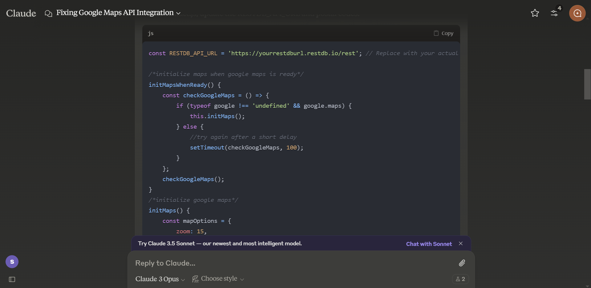

# MokeSell

MokeSell revolutionizes the furniture marketplace by combining traditional e-commerce with innovative gamification. Our platform creates a vibrant community where users don't just buy and sell - they earn rewards, compete in games, and build trust through verified reviews.

Unlike typical marketplaces, MokeSell enhances the user experience through our unique Dino game feature where users can earn points for discounts, making furniture shopping both rewarding and entertaining. The platform emphasizes user trust through detailed listings, verified reviews, and a points-based reward system.

## Design Process
 
Our development focused on creating an intuitive platform that serves both buyers and sellers while adding engaging gamification elements. We identified key user needs through research and created solutions that make furniture trading more enjoyable and trustworthy.

### User Stories

1. **As a furniture seller**, I want to easily create and manage multiple listings, so I can efficiently sell my items
   - Streamlined listing creation with multi-image upload
   - 30-day listing management system
   - Category-based organization
   - Bump feature for better visibility

2. **As a bargain hunter**, I want to earn rewards while shopping, so I can get better deals
   - Points system through Dino game
   - Redeemable vouchers
   - Daily rewards
   - Leaderboard competition

3. **As a buyer**, I want to trust the sellers and products, so I can make confident purchases
   - Detailed seller profiles
   - Transaction-based review system
   - Real-time chat feature
   - Clear product images and descriptions

You can view the development wireframes here: [Wireframe Link to be inserted]

## Features

### Existing Features

1. **User Authentication System**
   - Secure registration and login
   - Profile management with activity tracking
   - Password recovery system
   - Session handling

2. **Listing Management**
   - Multi-image upload with preview
   - Category and subcategory organization
   - Condition specification options
   - 30-day listing cycle
   - Listing bump feature

3. **Gamification System**
   - Interactive Dino game
   - Points accumulation
   - Leaderboard rankings
   - Voucher redemption
   - Achievement tracking

4. **Communication System**
   - Real-time chat functionality
   - Offer submission
   - Automated notifications
   - Chat history tracking

5. **Review and Rating System**
   - Transaction-verified reviews
   - Multi-category ratings
   - Photo review capability
   - Seller reputation tracking

### Features Left to Implement
- Integrated payment system
- AR furniture preview
- Delivery service integration
- Mobile app development
- Price comparison tool

## Technologies Used

- [HTML5](https://developer.mozilla.org/en-US/docs/Web/Guide/HTML/HTML5)
    - Page structure and content organization

- [CSS3](https://developer.mozilla.org/en-US/docs/Web/CSS)
    - Styling and responsive design
    - Animation effects

- [JavaScript](https://developer.mozilla.org/en-US/docs/Web/JavaScript)
    - Dynamic content and interactivity
    - Game implementation
    - Form validation

- [RestDB](https://restdb.io/)
    - Database for products, users, and game scores

- [Cloudinary](https://cloudinary.com/)
    - Image optimization and storage

- [Lottie](https://airbnb.io/lottie/)
    - Loading and success animations

## Assistive AI

1. Google Maps API Integration:
- Used Claude.AI to assist with implementing the Google Maps API for the contact page
- The AI helped with proper API key handling and map initialization
- Assisted in creating markers and custom styling

## Testing

1. Authentication System:
    1. Attempt empty form submission - verified required field messages
    2. Test invalid email formats - confirmed error messages
    3. Check password strength requirements
    4. Verify successful registration flow
    5. Test login with valid/invalid credentials

2. Listing Creation:
    1. Verify multi-image upload functionality
    2. Test form validation for required fields
    3. Check category selection process
    4. Confirm listing preview accuracy
    5. Test 30-day expiration functionality

3. Dino Game System:
    1. Verify game controls across devices
    2. Test point accumulation accuracy
    3. Check leaderboard updates
    4. Validate reward redemption
    5. Test performance across browsers

4. Responsive Design Testing:
    - Mobile testing (iOS/Android)
    - Tablet testing (iPad/Samsung)
    - Desktop testing (various resolutions)
    - Cross-browser verification (Chrome/Firefox/Safari)

### Known Issues
1. File upload occasionally slow on Firefox mobile
2. Chat notifications delayed on some mobile browsers
3. Minor UI glitches in Safari
4. Game performance varies on older devices

## Credits

### Content
- Furniture category structure adapted from industry standards
- Game mechanics inspired by Chrome's Dino game

### Media
- Product placeholder images from [IKEA](https://www.ikea.com/sg/en/rooms/home-office/?utm_source=main-menu&utm_medium=website&utm_campaign=rooms)
- Icons from [Flaticon](https://www.flaticon.com/)
- Animations from [LottieFiles](https://lottiefiles.com)

### Acknowledgements
- Serene Ker and Shawntrice Yip